# Takebishi "Device Gateway" on Red Hat Device Edge

This demo introduces how to deploy Takebishi Device Gateway and RHAMQ to Red Hat Device Edge.

# Background
In Japan, there are many factories built about more than 30 years ago.
Therefore, there are still many legacy manufacturing equipments.
Also, in many cases, that equipment is not from a specific single vendor, but is multi-vendor.
For companies promoting smart factories, it is easy to start collecting data if the factory is new, while for older equipment, it is necessary to collect data using vendor-specific protocols.

Takebishi Device Gateway is a gateway solution that aggregates vendor-specific protocols into a single gateway function and enables data collection.

By combining Device Gateway with Red Hat open source technology, it is possible to flexibly implement data integration applications that target data from legacy PLCs as well.

The simplest configuration for an IoT Gateway pattern using Device Gateway is as follows: 

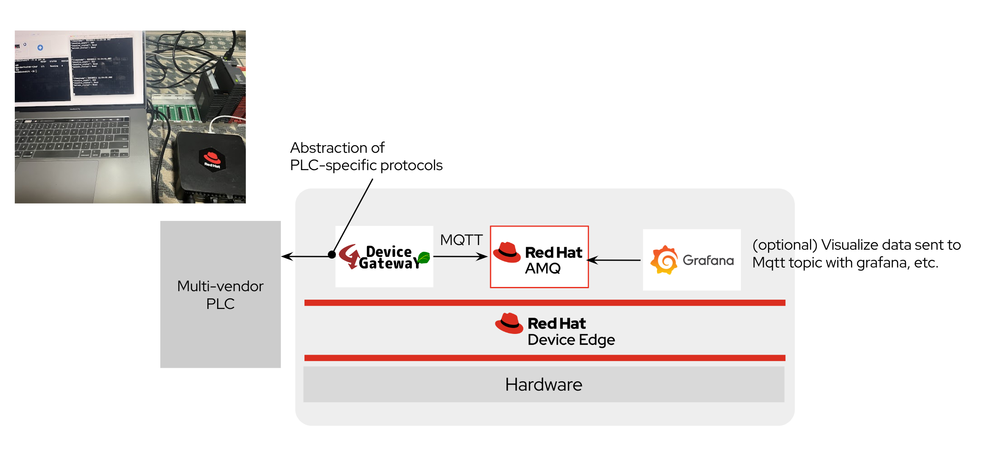

You can consider an edge box solution where PLC data collected by Device Gateway is sent to MQTT Broker (Red Hat AMQ) and applications such as inference and visualization, etc can be flexibly added onto the edge box via MQTT Broker.

# Environment
- HW: Intel NUC NUC12WSHi7
- Red Hat Enterprise Linux 9.2 & Red Hat Build of MicroShift

# Getting Started
Technical aspects in this demo are very simple.
In collaboration with Takebishi, you can run Takebishi's solution, Device Gateway, which can easily connect to old PLCs and other equipment, as a container on MicroShift.

## Instalation of MicroShift

Please refer to the following product document:
https://access.redhat.com/documentation/ja-jp/red_hat_build_of_microshift/4.13

## Clone this repository

```
git clone https://github.com/yd-ono/takebishi-devicegateway-with-microshift.git
cd takebishi-devicegateway-with-microshift/
```

## Create a namespace

```
oc create -f manifest/namespace.yaml
oc config set-context $(oc config current-context) --namespace=dgw
```

## Deploy Device Gateway

```bash
oc apply -f manifest/dgw
```

Check the pod status:

```bash
oc get po -n dgw
```

```
NAME                   READY   STATUS    RESTARTS   AGE
dgw-77c48c78b5-547j7   1/1     Running   0          5m16s
```

```
oc get svc
```

```
NAME   TYPE       CLUSTER-IP     EXTERNAL-IP   PORT(S)                      AGE
dgw    NodePort   10.43.20.141   <none>        80:31777/TCP,443:30000/TCP   78s
```

> Note1. Takebishi Device Gateway container images are provided as Red Hat certified container :
> https://catalog.redhat.com/software/container-stacks/detail/64b78a22c9f380494e648f67

> Note2. If you cannot use TopoLVM, please change `manifest/dgw/deployment.yaml` as follows:


```yaml
39      volumes:
40    - name: pvc-dxpgateway
41        hostPath:
42          path: /dgw/pvc-dxpgateway
43          type: DirectoryOrCreate
44      - name: pvc-sdcard
45        hostPath:
46          path: /dgw/pvc-sdcard
47          type: type: DirectoryOrCreate
```

You can access Device Gateway's web console via Route:

```bash
oc get route -n dgw -ojsonpath='{.items[*].status.ingress[*].host}'
```

Alternatively, use NodePort to access the following URL:

```
https://<YOUR_DEVICE_IP>:30000
```

  

Default account is as follows:

```
username: administrator
password: admin
```

## Deploy Red Hat AMQ

The data collected by Device gateway can then be linked to IT applications via Red Hat AMQ, or more specifically, ActiveMQ.

Deploy AMQ Broker Operator:

```bash
oc apply -f manifest/amq
```

Check the pod status:

```bash
oc get po,svc -n dgw
```

```
NAME                       READY   STATUS    RESTARTS   AGE
pod/amq-broker-0           1/1     Running   0          33s

NAME                          TYPE       CLUSTER-IP     EXTERNAL-IP   PORT(S)                          AGE
service/amq-broker-hdls-svc   NodePort   10.43.58.243   <none>        8161:31160/TCP,61616:32000/TCP   33s
```

## Deploy Grafana

Grafana is used to visualize data on RHAMQ. Please APPLY the following manifest.

```bash
oc apply -f manifest/grafana
```

Check Grafana status.

```bash
oc get po,svc
```

```bash
NAME                           READY   STATUS    RESTARTS   AGE
pod/grafana-7b9c866597-gvtvd   1/1     Running   0          25s

NAME                          TYPE       CLUSTER-IP      EXTERNAL-IP   PORT(S)                          AGE
service/grafana               NodePort   10.43.144.225   <none>        3000:30001/TCP                   25s
```

Open a browser and go to the following URL:

```
http://<YOUR_DEVICE_IP>:30001
```


# Configuration of Device Gateway
All Device Gateway settings are done through the web console. Here, as a simple test, we will add a setting to send Device Gateway status to MQTT broker in 1 second cycles.

## IoT Interface Settings
**1) Open the "IoT Interface" tab and click the "+" button in the "MQTT" section.**

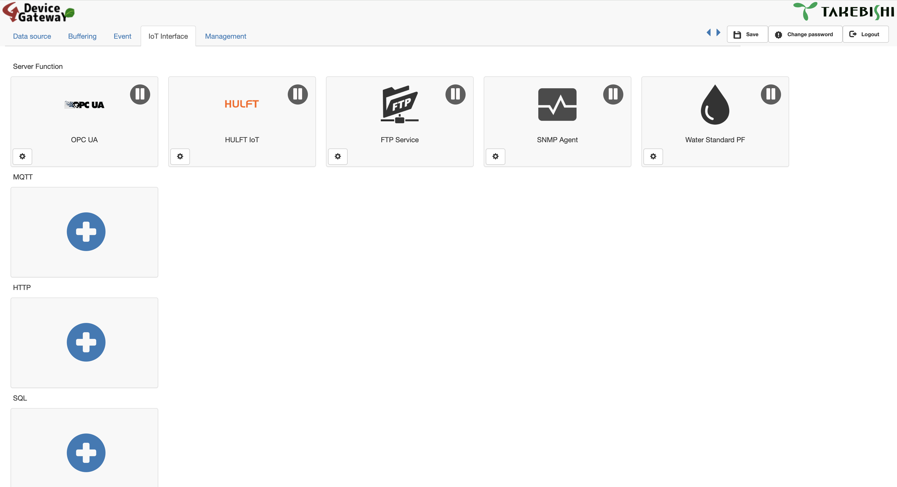

**2) In the Host column, specify the MQTT endpoint of Red Hat AMQ that you have just deployed:**

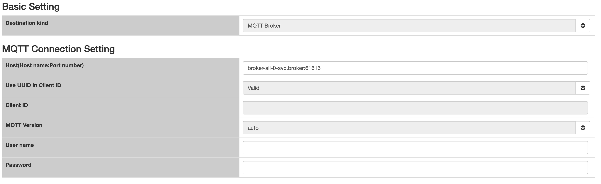


| ------------- | ------------- |
| Host  | amq-broker-hdls-svc:61616  |
| Client ID  | demo  |

Click the green check mark in the upper right corner of the screen to update the settings, then press the "Save" button in the menu at the top of the screen.

## Event Settings

Event settings are usually some action on a data source, such as a PLC. In this example, you configure Red Hat AMQ to send data in JSON format as follows:

**1) Open the "Event" tab and click the "+" button in the "Event" section.**
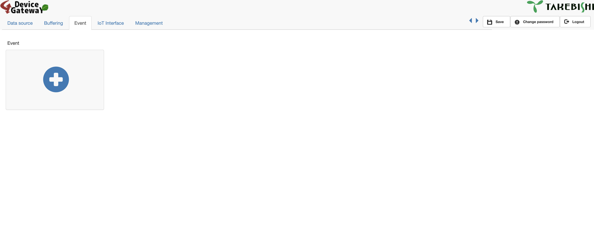

**2)Select "Cycle" in the Trigger menu**
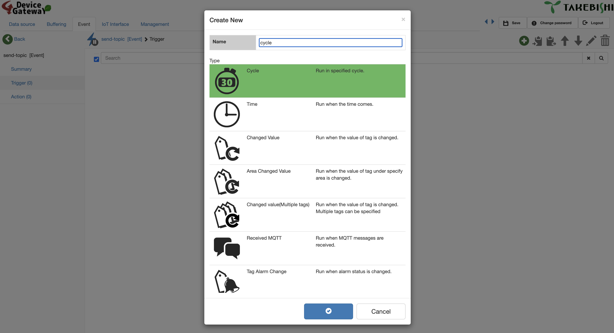

**3)Select "Send MQTT" in the Action menu.**
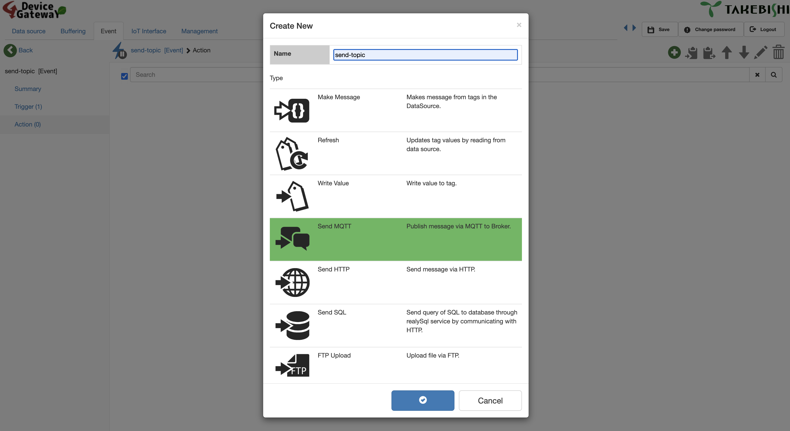

**4)Configuration of sending to MQTT Topic**

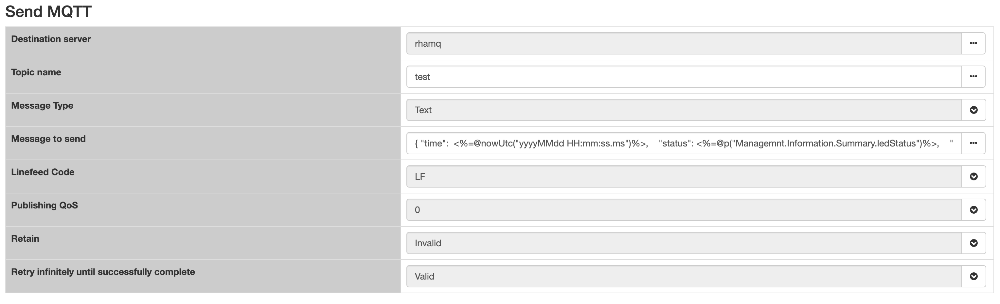

The format of the Message to be sent is, for example, as follows:

```json
{"send-packet": <%=@p("Managemnt.Lan.Summary.sendBytes0")%>,  "recieve-packet": <%=@p("Managemnt.Lan.Summary.receiveBytes0")%>}
```

Click the green check mark in the upper right corner of the screen to update the settings, then press the "Save" button in the menu at the top of the screen.

## Check the data sent to MQTT topic
Install mosquitto's CLI in an environment that can connect to MicroShift, and execute the following command, and you can check the status of data sent to MQTT Topic.

```bash
$ mosquitto_sub -h <YOUR_DEVICE_IP> -p 32000 -t test
```

```JSON
{"send-packet": 6770149,  "recieve-packet": 787433}
{"send-packet": 6770780,  "recieve-packet": 788061}
```


# Configuration of Grafana

## Login to Grafa dashboard

Default account is as follows:

```
username: admin
password: admin
```

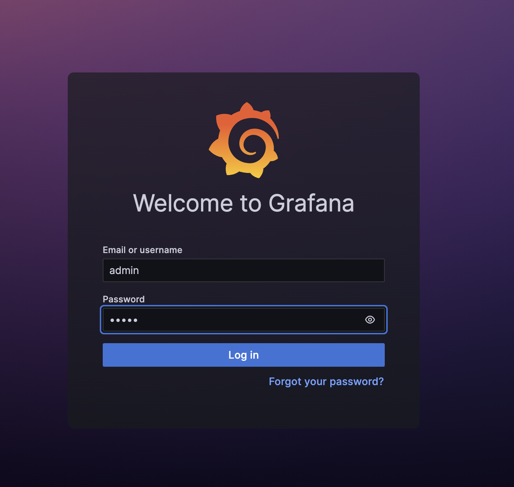

## Data source setting

Select [Connections]-[Data sources] from the side menu:

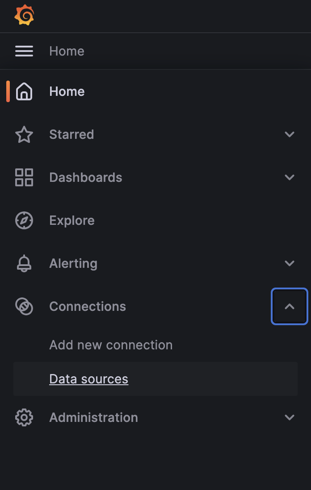

Click `Add data source` to search for MQTT:

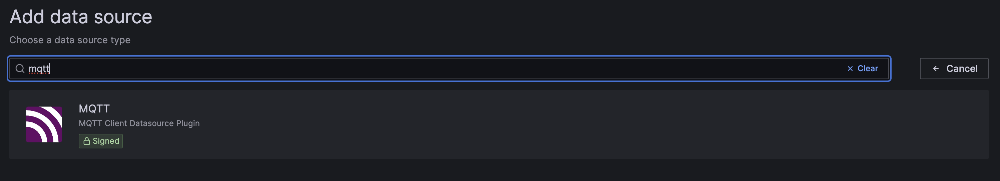

Setting MQTT data source as follows:

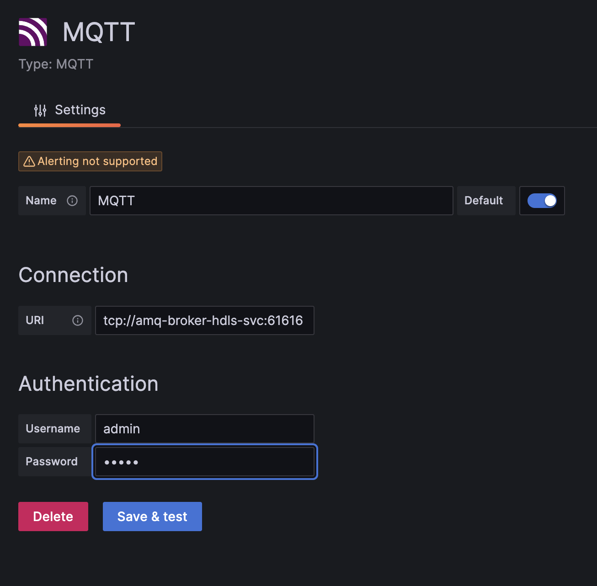

## Create a dashboard

Select `Dashboards` from side menu:

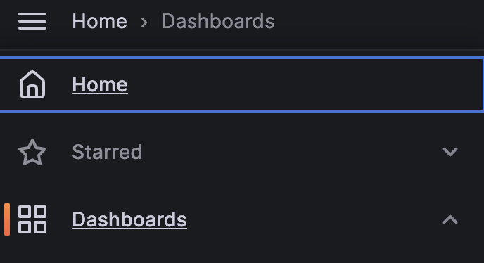

Click `import dashboard` to import `manifest/grafana/demo.json`

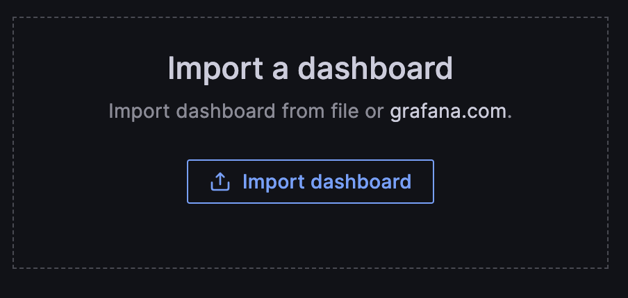


Data on the MQTT Broker can be displayed as a graph as shown below. In this demo, the number of bytes sent/received by the Device Gateway is simply displayed as a graph. 

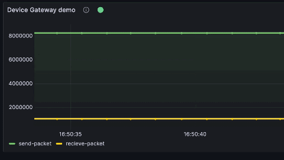

To pub the PLC data to the MQTT Broker, set up a connection with the PLC in the `Data source` setting of the Device Gateway and register the PLC register from which the data was acquired as a tag. 

Then, in the `Event` setting, insert the tag as a macro and you can visualize the data in Grafana using the same procedure.

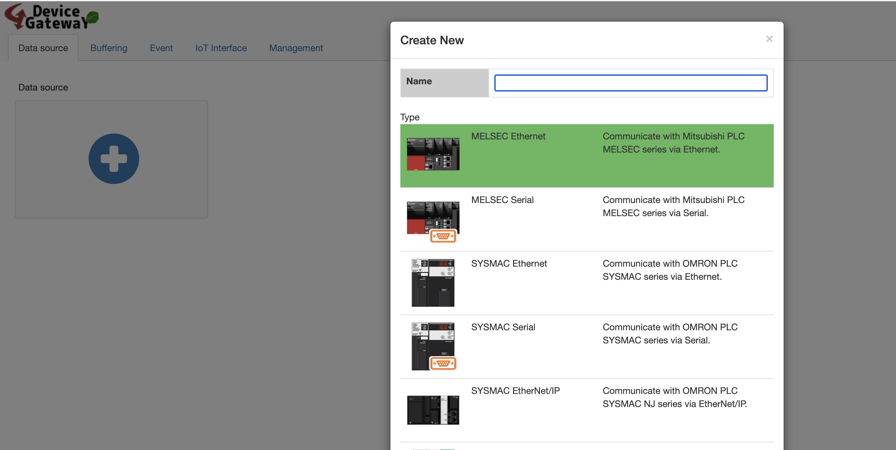

## Demo video of PLC data visualization

[](https://www.youtube.com/watch?v=N5UEwtG5lck)